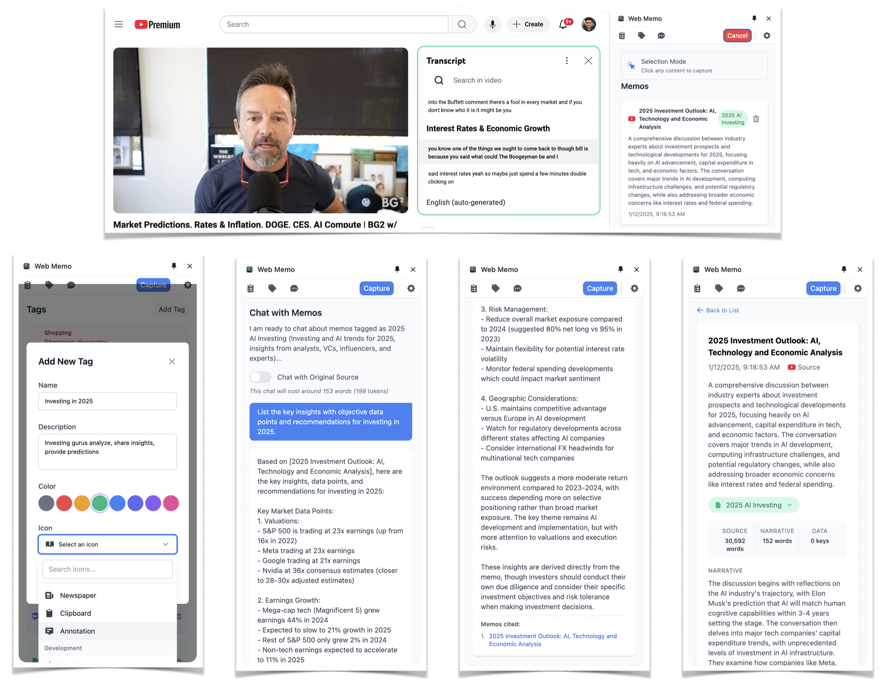

# 🧠 Avnam AI Memo

> Transform your web browsing into an intelligent knowledge base with AI-powered content capture and chat

[](https://chrome.google.com/webstore)
[](https://github.com/anthropics/claude-code)
[](https://developer.chrome.com/docs/extensions/mv3/)
[](https://anthropic.com)
[](https://openai.com)
[](https://aws.amazon.com/bedrock)
[](https://ai.google.com/gemini)

**Avnam AI Memo** is the first Chrome extension to offer **multi-LLM support** for intelligent web content management. Choose from **Anthropic Claude**, **OpenAI GPT**, **AWS Bedrock**, or **Google Gemini** to capture, organize, and chat with your web content exactly how you prefer.

---

## ✨ Features


*See Avnam AI Memo in action: capture, organize, and chat with your web content*

### 🚀 **Multi-LLM AI Support** ⭐ *Industry First*
- **Choose your AI**: Select from Anthropic Claude, OpenAI GPT, AWS Bedrock, or Google Gemini
- **Provider switching**: Change AI providers without losing your data
- **Optimized performance**: Each provider optimized for specific use cases
- **Unified interface**: Consistent experience across all AI providers
- **Cost flexibility**: Use the most cost-effective provider for your needs

### 🎯 **Smart Content Capture**
- **One-click capture**: Highlight and save any content from web pages
- **Intelligent processing**: AI automatically extracts titles, summaries, and structured data
- **Cross-origin support**: Works on any website with robust content extraction
- **Visual feedback**: Real-time highlighting and status updates

### 🏷️ **AI-Powered Organization**
- **Smart tagging**: 70+ predefined categories with custom icons and colors
- **Hierarchical structure**: Organize memos with nested tag systems  
- **Auto-categorization**: AI suggests relevant tags based on content
- **Visual customization**: Color-coded tags with emoji and icon support

### 💬 **Conversational AI Chat**
- **Context-aware conversations**: Chat with your memos using filtered context
- **Citation system**: AI responses include references to source memos
- **Tag-based filtering**: Focus conversations on specific topics or categories
- **Export functionality**: Save chat history and insights

### 🔄 **Seamless Sync & Storage**
- **Cross-device sync**: Your memos available across all Chrome installations
- **Local-first**: Fast access with local storage, cloud backup
- **Data integrity**: JSON validation and automatic backup systems
- **Export options**: Download your data anytime

### 🎨 **Modern Interface**
- **Side panel design**: Integrated Chrome side panel experience
- **Responsive UI**: Clean, modern interface built with Tailwind CSS
- **Real-time updates**: Instant status feedback and smooth animations
- **Accessibility**: Keyboard shortcuts and screen reader support

---

## 🚀 Quick Start

### Installation

1. **Download** the extension files
2. **Build** the extension:
   ```bash
   npm install
   npm run build
   ```
3. **Load** in Chrome:
   - Open `chrome://extensions/`
   - Enable "Developer mode"
   - Click "Load unpacked" and select the project directory

### Setup

1. **Choose your AI provider**: Select from 4 supported providers
   - **Anthropic Claude**: Get your key at [console.anthropic.com](https://console.anthropic.com/)
   - **OpenAI GPT**: Get your key at [platform.openai.com](https://platform.openai.com/api-keys)
   - **AWS Bedrock**: Configure AWS credentials and Bedrock access
   - **Google Gemini**: Get your key at [aistudio.google.com](https://aistudio.google.com/)

2. **Configuration**: Open the extension settings and:
   - Select your preferred AI provider
   - Enter your API key
   - Choose your preferred model (optional)

3. **Ready to go**: Start capturing content and chatting with your chosen AI!

---

## 🆚 Why Choose Avnam AI Memo?

### **vs. Other Web Clippers**

| Feature | Avnam AI Memo | Traditional Clippers | Other AI Clippers |
|---------|---------------|---------------------|-------------------|
| **AI Provider Choice** | ✅ 4 Providers (Claude, GPT, Bedrock, Gemini) | ❌ None | ⚠️ Single Provider |
| **Intelligent Tagging** | ✅ AI-powered with 70+ categories | ❌ Manual only | ⚠️ Limited categories |
| **Context-Aware Chat** | ✅ Chat with filtered memo collections | ❌ No chat | ⚠️ Basic chat |
| **Cross-Origin Support** | ✅ Works on any website | ⚠️ Limited sites | ⚠️ Limited sites |
| **Local-First Privacy** | ✅ Data stays local, optional sync | ❌ Cloud-dependent | ⚠️ Varies |
| **Citation System** | ✅ AI responses link to source memos | ❌ No citations | ❌ No citations |
| **Cost Flexibility** | ✅ Choose cheapest provider for your needs | ❌ N/A | ❌ Locked to one provider |

### **Unique Advantages**

- **🚀 Industry-First Multi-LLM Support**: No other Chrome extension offers choice between 4 major AI providers
- **💰 Cost Optimization**: Switch to the most cost-effective AI provider for your usage patterns
- **🔄 Provider Flexibility**: Test different AI models for different tasks without losing your data
- **🧠 Context Intelligence**: AI understands your project organization for better responses
- **🔒 Privacy-First**: Your content stays local unless you choose to sync

---

## 📖 User Guide


*Complete workflow: From content capture to AI-powered organization and chat*

### Capturing Content

1. **Navigate** to any webpage
2. **Open** the side panel (click the extension icon)
3. **Click** "Capture Content" to enter highlight mode
4. **Select** any text, image, or element on the page
5. **Watch** as AI processes and organizes your content

### Organizing with Tags

- **Auto-tagging**: AI suggests relevant tags for each memo
- **Custom tags**: Create your own categories with colors and icons
- **Tag management**: Edit, merge, or delete tags from the settings
- **Filtering**: Use tags to filter memos and chat context

### AI Provider Selection

1. **Open Settings**: Click the extension icon and go to Settings
2. **Choose Provider**: Select from the dropdown:
   - **Anthropic Claude**: Best for analysis and reasoning
   - **OpenAI GPT**: Great for creative tasks and code
   - **AWS Bedrock**: Enterprise-grade with Claude via AWS
   - **Google Gemini**: Excellent for multimodal content
3. **Configure**: Enter your API key and select model
4. **Test Connection**: Verify your setup works
5. **Switch Anytime**: Change providers without losing data

### AI Chat Features

1. **Filter context**: Select tags to focus your conversation
2. **Ask questions**: Query your knowledge base naturally
3. **Get citations**: AI responses reference specific memos
4. **Export chats**: Save conversations for future reference
5. **Compare AI responses**: Try different providers for the same query

### Data Management

- **View all memos**: Browse your captured content chronologically
- **Search & filter**: Find specific content using tags or keywords
- **Export data**: Download your memos and chats as JSON
- **Backup**: Automatic sync keeps your data safe

---

## 🛠️ Technical Architecture

### Core Components

- **Background Service Worker**: Handles API communication and data processing
- **Content Scripts**: Manages web page content capture and highlighting
- **Side Panel Interface**: Primary user interface for memo and chat management
- **Storage System**: Chrome storage.local/sync for data persistence

### Multi-LLM Architecture

- **Provider Factory Pattern**: Unified interface for all AI providers
- **LLM Provider Base Class**: Common interface implementation for consistent behavior
- **Provider-Specific Implementations**:
  - **Anthropic Provider**: Claude 3.5 Sonnet, Claude 3 Haiku
  - **OpenAI Provider**: GPT-4, GPT-3.5 Turbo
  - **AWS Bedrock Provider**: Claude via AWS infrastructure
  - **Google Gemini Provider**: Gemini Pro, Gemini Pro Vision
- **Configuration Management**: Secure multi-provider API key storage
- **Dynamic Provider Switching**: Change providers without data loss

### AI Integration Features

- **Token optimization**: Efficient content chunking for API limits across all providers
- **Structured extraction**: Automatic title, summary, and metadata generation
- **Cost tracking**: Built-in token counting and usage estimation per provider
- **Provider-specific optimizations**: Leverages unique capabilities of each AI model

### Security & Privacy

- **Local-first**: Content stored locally in Chrome storage
- **Secure API**: Encrypted communication with Anthropic
- **No tracking**: Zero analytics or user behavior tracking
- **CSP compliance**: Strict Content Security Policy implementation

---

## 🗺️ Roadmap

### ✅ **v1.0 - Foundation Complete**
- [x] **Multi-LLM Support**: Anthropic Claude, OpenAI GPT, AWS Bedrock, Google Gemini
- [x] **Smart Content Capture**: One-click web content extraction
- [x] **AI-Powered Organization**: 70+ category tags with intelligent suggestions
- [x] **Context-Aware Chat**: Conversational AI with memo citations
- [x] **Local-First Storage**: Chrome storage with cross-device sync
- [x] **Provider Factory Architecture**: Modular, extensible AI provider system

### 🎯 **v1.1 - Enhanced Intelligence** *(Q1 2025)*
- [ ] **Local LLM Integration**: Ollama support for private AI processing
- [ ] **Advanced search**: Semantic search across memo content
- [ ] **Smart summaries**: AI-generated daily/weekly content digests  
- [ ] **Related content**: Automatic linking of similar memos
- [ ] **Bulk operations**: Mass tagging and memo management

### 🎯 **v1.2 - Rich Media Support** *(Q2 2025)*
- [ ] **Visual content**: OCR and image analysis capabilities
- [ ] **YouTube integration**: Direct video transcript capture and processing
- [ ] **PDF processing**: Import and analyze document content
- [ ] **Audio content**: Podcast and audio file processing
- [ ] **Extended formats**: Markdown, social media threads, and more

### 🎯 **v1.3 - Collaboration Features** *(Q3 2025)*
- [ ] **Shared collections**: Collaborate on memo collections
- [ ] **Team workspaces**: Multi-user organization features
- [ ] **Export formats**: PDF, Markdown, and presentation exports
- [ ] **Integration APIs**: Connect with Obsidian, Notion, and other tools

### 🎯 **v1.4 - Ecosystem Integration** *(Q4 2025)*
- [ ] **Browser sync**: Firefox and Safari extensions
- [ ] **Mobile app**: iOS and Android companion apps
- [ ] **Desktop app**: Standalone application for power users
- [ ] **Web interface**: Access your memos from any device

### 🔮 **Future Vision**
- **Knowledge graphs**: Visual relationship mapping between memos
- **Automated workflows**: Trigger actions based on content patterns
- **Personal AI assistant**: Proactive content suggestions and insights
- **Enterprise features**: SSO, admin controls, and compliance tools

---

## 🤝 Contributing

We welcome contributions! Please see our [Contributing Guidelines](CONTRIBUTING.md) for details.

### Development Setup

```bash
# Clone the repository
git clone https://github.com/yourusername/avnam-ai-memo.git

# Install dependencies (includes multi-LLM support)
npm install
# Dependencies include:
# - @anthropic-ai/sdk for Claude integration
# - @aws-sdk/client-bedrock-runtime for AWS Bedrock
# - Native fetch for OpenAI and Gemini (no extra deps needed)

# Build the extension
npm run build

# Load in Chrome for testing
# Follow the installation instructions above
```

### Provider-Specific Setup

#### 🤖 **Anthropic Claude**
```bash
# Get API key at console.anthropic.com
# Supports: Claude 3.5 Sonnet, Claude 3 Haiku
# Best for: Complex reasoning, analysis, coding
```

#### 🧠 **OpenAI GPT**
```bash
# Get API key at platform.openai.com/api-keys
# Supports: GPT-4, GPT-3.5 Turbo
# Best for: Creative writing, code generation, general tasks
```

#### ☁️ **AWS Bedrock**
```bash
# Configure AWS credentials
# Requires: AWS account with Bedrock access
# Supports: Claude models via AWS infrastructure
# Best for: Enterprise environments, AWS integration
```

#### 🎯 **Google Gemini**
```bash
# Get API key at aistudio.google.com
# Supports: Gemini Pro, Gemini Pro Vision
# Best for: Multimodal content, Google ecosystem
```

### Testing

```bash
# Run tests (when available)
npm test

# Build for production
npm run build
```

---

## 📄 License

This project is licensed under the MIT License - see the [LICENSE](LICENSE) file for details.

---

## 🙏 Acknowledgments

- **Anthropic** for the powerful Claude AI API
- **Chrome Extensions Team** for the excellent Manifest V3 platform
- **Open Source Community** for inspiration and tools

---

## 📞 Support

- **Issues**: [GitHub Issues](https://github.com/yourusername/avnam-ai-memo/issues)
- **Discussions**: [GitHub Discussions](https://github.com/yourusername/avnam-ai-memo/discussions)
- **Email**: support@avnam.ai

---

<div align="center">

**⭐ Star this repo if Avnam AI Memo helps your productivity!**

Made with ❤️ by the Avnam team

</div>
